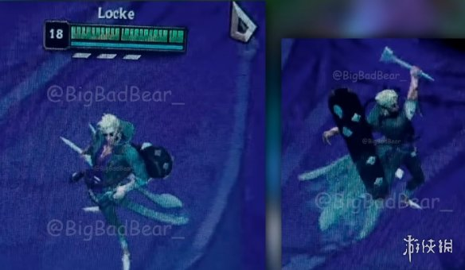
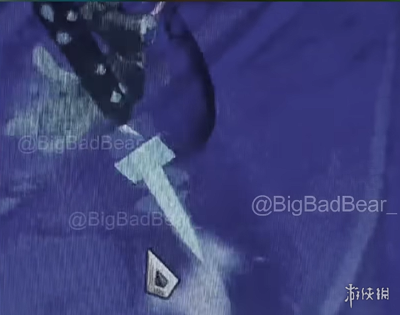
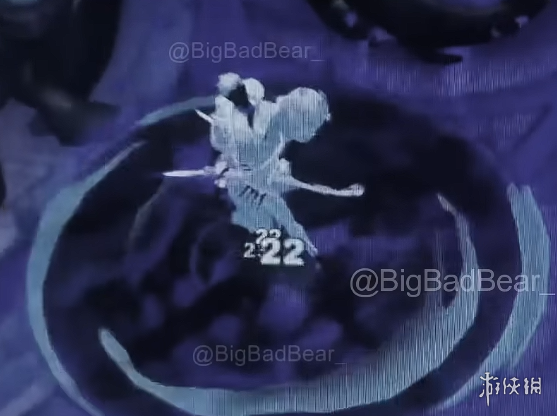

# 新英雄Locke：恶魔猎手设定全面曝光

拳头确认2026年第二赛季将仅推出一位新英雄，名为Locke，定位为“恶魔猎手”。从曝光的设定图来看，这位男性角色拥有白色头发、黑色墨镜和绿色披风，武器是一把造型独特的长钉。这种视觉风格让人联想到《暗黑破坏神》中的猎魔人，但结合了LOL独有的美术语言——冷酷中带着一丝优雅。

根据爆料信息，Locke的核心玩法将围绕“标记与追击”展开。其Q技能可以投掷长钉对敌人造成伤害并附加减速效果，W技能提供一段位移并短暂隐身，E技能则能在地面设置陷阱，对踩中的敌人造成持续伤害。而他的大招据称可以生成一个领域，在领域内Locke的攻击会获得额外穿透，且每次命中敌人都会减少小技能的冷却时间。这种设计使得Locke既有刺客的高爆发，又具备一定的持续作战能力。

从背景故事来看，Locke是符文大陆上专门猎杀恶魔的赏金猎人，他佩戴的墨镜能够看穿敌人的伪装，绿色的披风则是由被猎杀的恶魔灵魂淬炼而成。这种设定与目前厄加特、卡莎等“黑暗英雄”的叙事线有所关联，或许暗示着符文大陆即将迎来一场新的恶魔入侵事件。拳头选择在第二赛季推出这样一位英雄，显然是想在后半年为游戏注入新的战术变量。

考虑到当前版本中刺客英雄的弱势地位（26.6补丁正在准备加强），Locke的登场时机非常微妙。如果他能在上线后成为大赛热门，很可能会重塑上路与中路之间的对抗格局。毕竟一位兼具追击、隐身和领域控制能力的猎手，在团战中的操作上限极高。目前官方尚未公布具体的技能数值和上线时间，但从设计理念来看，Locke极有可能成为今年全球总决赛的“版本答案”之一。

---
*生成时间: 2026-05-29 18:01 | 自动生成 by Claude*