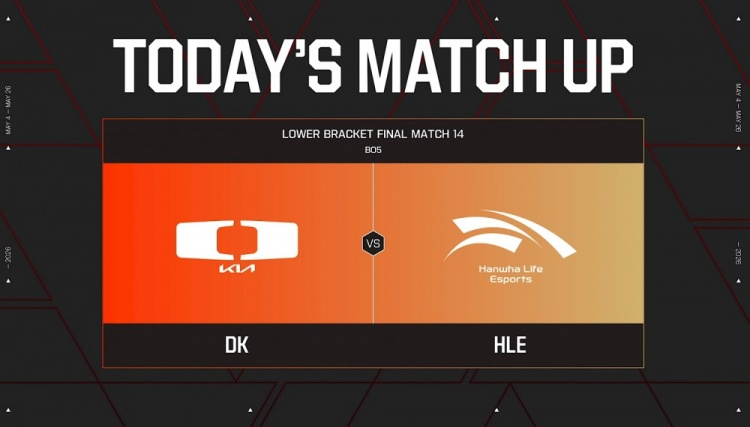
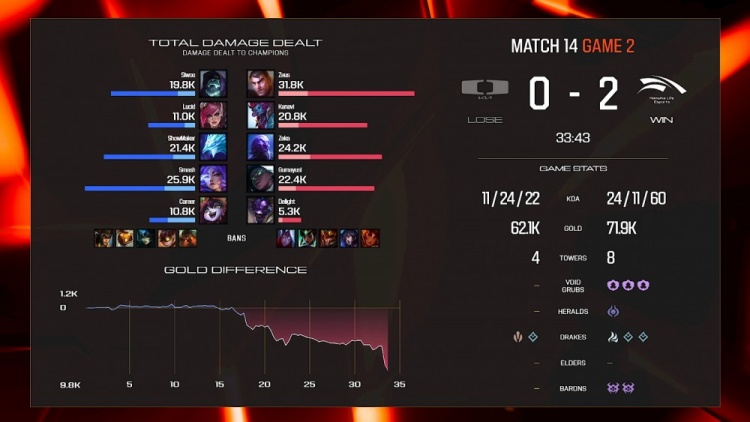
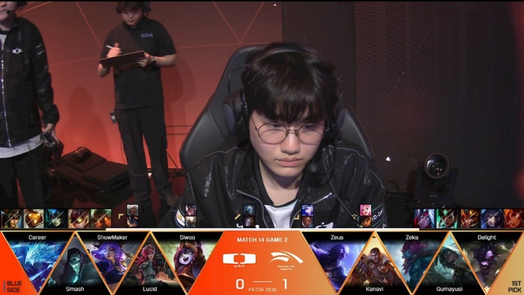

# Zeus杰斯伪四杀：一炮定乾坤，HLE上单封神之战

在EWC韩国区预选赛HLE对阵DK的第二局中，HLE上单Zeus的杰斯贡献了本赛季最为惊艳的个人表演。当DK试图通过大龙逼团扭转局势时，Zeus站在龙坑上方，一记精准的加强炮直接轰残DK三名脆皮。随后他果断闪下龙坑，切换锤形态连续击杀两人，最终完成伪四杀。

这波操作不仅体现了Zeus对杰斯技能CD的精确计算，更展现了他对战场嗅觉的敏锐。在装备并未完全领先的情况下，他利用草丛视野和炮形态的远程消耗，为队伍创造了奇迹般的翻盘机会。

事实上，Zeus在LCK夏季赛的表现一直起伏不定。但今天他证明了自己依然是世界级的上单选手。面对Doran（DK上单）的压制，他选出了杰斯这个高风险高回报的英雄，并且在团战中完美执行了战术意图。

对于HLE而言，Zeus的状态回暖无疑是个好消息。如果他们能晋级EWC正赛，Zeus将成为其战术体系中最重要的Carry点之一。

**小结：** Zeus的杰斯伪四杀，不仅成为今日比赛的转折点，也让所有观众再次见证了顶尖上单的恐怖统治力。在ADC被频繁针对的版本，上单的发挥往往决定了比赛的走向。Zeus用这一场表演向世界宣告：他依然是那个值得信赖的“世一上”候选者。

*来源：直播吧 | 2026-05-29*

---
*生成时间: 2026-05-29 16:48 | 自动生成 by Claude*