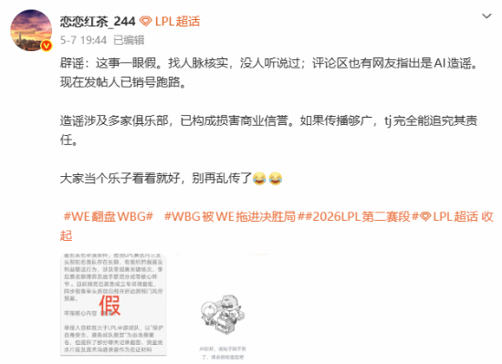

# LPL地震：BLG、TES、JDG被曝长期假赛，网友扒出惊人内幕

2026年5月7日，一则爆炸性消息在电竞圈炸开——LPL三大顶级战队BLG、TES、JDG被曝存在长期假赛行为。根据360游戏转载的网友爆料，有内部人士提供了大量疑似“操盘”的聊天记录和资金流水。这些证据显示，在某些关键比赛（如季后赛资格战、德玛西亚杯）中，队内部分选手存在故意失误、控制比赛时长等行为。

爆料中特别指出，这三支战队在2024年至2026年期间的多场比赛中，盘口异常波动幅度超过行业平均水平。例如，2025年LPL夏季赛BLG对阵WBG的一场常规赛，赛前赔率突然从1.8降至1.2，但比赛中BLG的核心选手出现了多次低级失误，最终爆冷落败。

此次事件引发了网友对LPL假赛产业链的深度挖掘。有分析指出，部分退役选手和教练可能充当了中间人角色，利用自身影响力向现役选手施压。更令人担忧的是，涉事战队中不乏多名明星选手，他们的粉丝一时间陷入信任危机。

目前，LPL官方尚未正式回应此事，但已有多个电竞媒体呼吁拳头游戏介入调查。若查实，涉事选手将面临禁赛甚至终身禁赛的处罚。

**小结：** LPL假赛传闻的爆发，不仅仅是一次草根爆料，更折射出电竞产业快速扩张背后的阴暗面。高额的商业利益让一些人不惜铤而走险。作为观众，我们期待官方能尽快给出透明、公正的调查结果，还电竞一个干净的竞技环境。

*来源：360游戏 | 2026-05-29*

---
*生成时间: 2026-05-29 16:48 | 自动生成 by Claude*