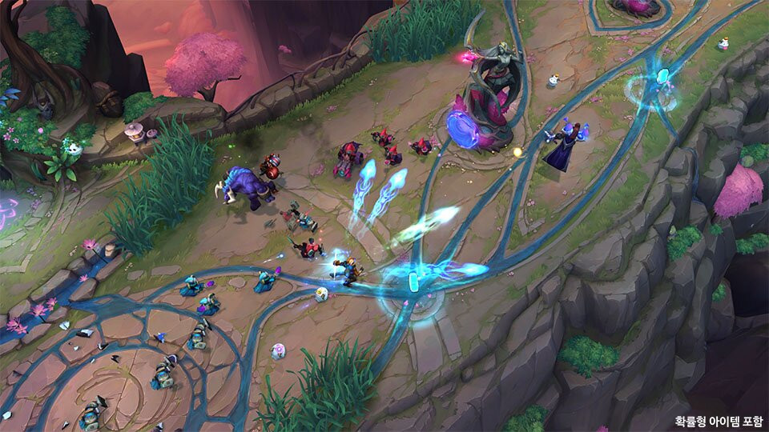

# 拳头公布2026第二赛季重大更新：T1冠军皮肤7月来袭

拳头游戏在5月28日正式宣布，2025全球总决赛冠军T1的专属皮肤将于7月份正式登陆游戏。这组皮肤包括安蓓萨（Doran）、赵信（Oner）、加里奥（Faker）、芸阿娜（Gumayushi）、至臻女枪（Gumayushi）以及萨勒芬妮（Keria）。其中，至臻女枪是Gumayushi选手的专属版本，将以特殊炫彩形式呈现。

在官方放出的预览图中，T1皮肤延续了经典的蓝白配色，并在特效中融入了T1队标和2025世界赛奖杯的图标。加里奥的R技能落地时会出现巨大的T1旗帜，而Oner的赵信在开大时会形成一圈蓝白色的护盾墙。

同时，拳头也披露了2026第二赛季的其他更新内容。除了新英雄Locke外，游戏还将推出全新的任务系统——“英雄之旅”，玩家可以通过完成日常/周常任务获得限定表情和边框。此外，峡谷先锋的刷新机制也将调整，从之前的双峡谷先锋改为单峡谷先锋，但能召唤的炮车兵数量翻倍，旨在加快比赛节奏。

**小结：** T1冠军皮肤的上线无疑是2026年夏季最具纪念意义的时刻。对于粉丝而言，这不仅是对Faker等人第四次夺冠的致敬，更是对LCK统治力的又一次彰显。而第二赛季的整体更新，则体现了拳头在平衡职业赛场与普通玩家体验之间的努力。

*来源：Inven Global、游侠网 | 2026-05-29*

---
*生成时间: 2026-05-29 16:48 | 自动生成 by Claude*