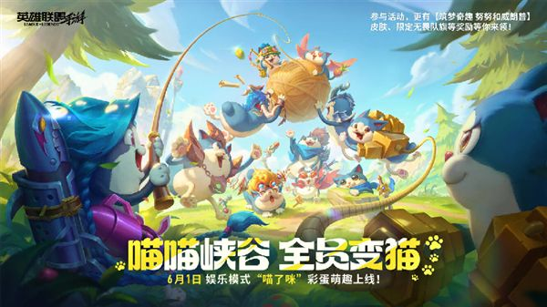
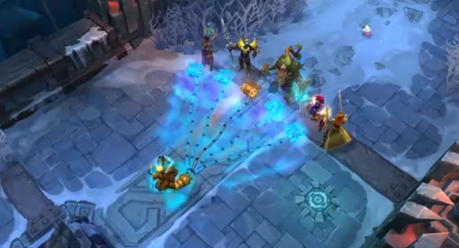

# 英雄联盟手游携手NBA：湖人、凯尔特人、勇士限定皮肤即将登陆

在SPARK 2026腾讯游戏发布会上，腾讯宣布《英雄联盟手游》将携手NBA中国、景德镇青花瓷带来跨界联动内容。其中最引人注目的是三款NBA球队限定皮肤：**湖人神话德莱厄斯**、**凯尔特人传奇莫德凯撒**以及**勇士辉煌嘉文四世**。

从官方放出的原画来看，德莱厄斯身穿紫金战袍，手持镶嵌珠宝的巨斧，肩部设计融入了湖人队标；莫德凯撒则身着绿色铠甲，头盔带有三叶草标志；嘉文四世化身勇士队核心，手中长枪变成了勇士队的金色旗帜。这三款皮肤均拥有专属回城特效，回城时会出现对应球队的标志性图案。

此外，手游还将推出“湖人传奇珑宝”和“勇士宣言珑宝”两款守护灵，以及玩家票选出的“青花瓷”主题守护灵。全新娱乐模式“英雄喵化”也将在活动期间限时开启，玩家可以操作猫咪化的英雄进行趣味对局。

**小结：** 英雄联盟手游与NBA的联动，是腾讯游戏跨界营销的又一力作。篮球文化与MOBA游戏的结合，既能吸引NBA粉丝关注手游，也能为现有玩家带来新鲜感。青花瓷主题的加入，则体现了对中国传统文化的尊重。可以预见，这几款限定皮肤将成为手游玩家争相收藏的对象。

*来源：网易 | 2026-05-29*

---
*生成时间: 2026-05-29 16:48 | 自动生成 by Claude*